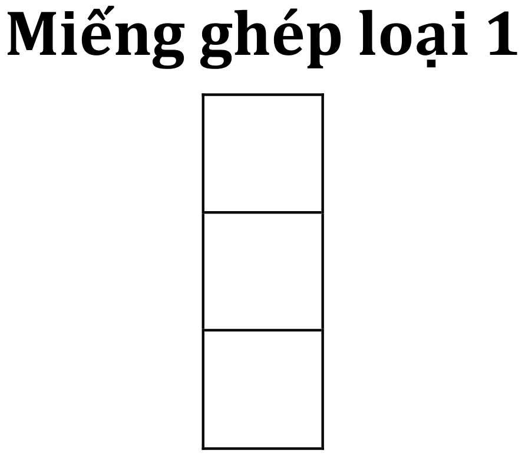
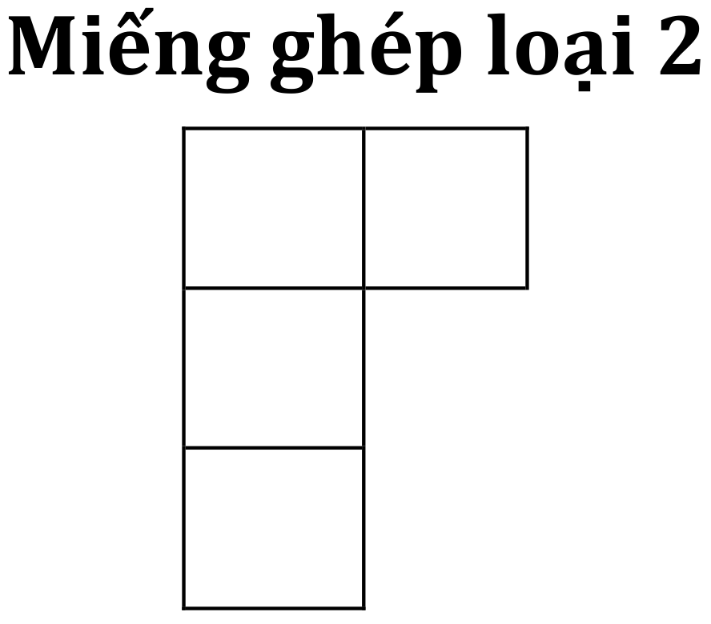
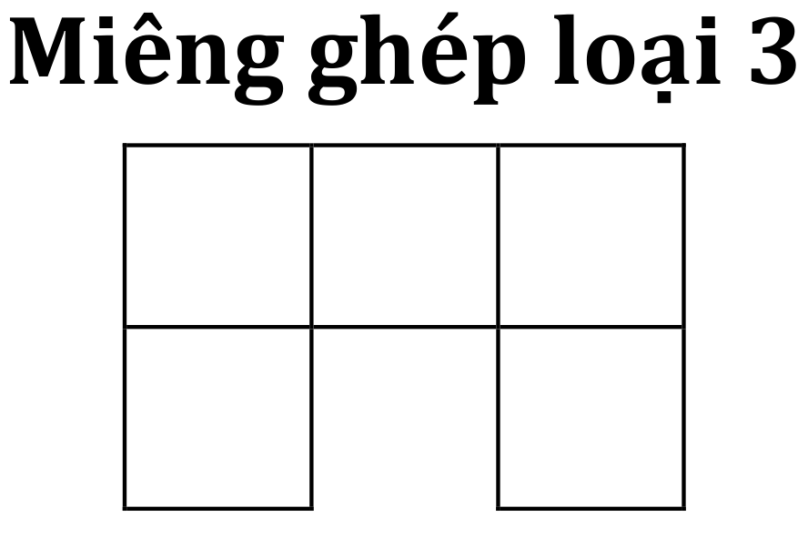
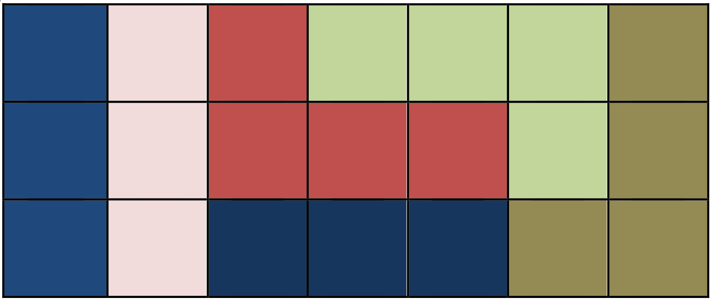

# ĐỀ THI BẢNG B – TRUNG HỌC CƠ SỞ

HỘI THI TIN HỌC TRẺ TOÀN QUỐC LẦN THỨ XX – 2016

Thời gian làm bài 150 phút, không kể thời gian phát đề

## Tổng quan bài thi

|  Tên bài  | Giới hạn thời gian | Số điểm |
| --------- | :----------------: | :-----: |
| Giao điểm |      Không có      |    20   |
| Xếp hình  |      Không có      |    40   |
| Từ điển   |      2 giây        |    40   |

## Giao điểm

Mùa hè 2014, những người ngoài hành tinh đã có một chuyến viếng thăm trái đất.
Họ đến bằng đĩa bay và đã chọn một cánh đồng của Việt Nam để hạ cánh. Đĩa bay
có dạng hình tròn với N chân đế nên mỗi đĩa bay đã để lại trên cánh đồng một
đường tròn với có N điểm trên đường tròn đó. Khi đĩa bay hạ xuống, các chân đế
của một đĩa bay đã phát tia lazer để kết nối với nhau để lại các đường cháy
trên cánh đồng. Ngay sáng hôm sau các nhà khoa học đã đến và dự đinh sẽ cắm tại
mỗi giao điểm của các đường cháy bên trong mỗi đường tròn một lá cờ. Họ cũng
phát hiện ra rằng, trong mỗi đường tròn không có 3 đường cháy nào cắt nhau tại
cùng một điểm (trừ các điểm chân đế của đĩa bay). Vấn đề đặt ra là với mỗi
đường tròn, họ đã phải sử dụng bao nhiêu lá cờ. Các bạn hãy tính giúp các nhà
khoa học nhé, đó chính là một con số quan trọng trong quá trình nghiên cứu sự
hiện diện của người ngoài trái đất tại Việt Nam.

Ví dụ, với hình dưới là đĩa bay có 5 chân đế tương ứng với N=5. Các đường cháy
để lại giao nhau tại 5 điểm.

Các bạn sẽ nhận được một báo cáo gồm có 10 dòng tương ứng với 10 số N khác nhau
là số lượng chân đế trên 10 chiếc đĩa bay khác nhau. Bạn cần tạo file
`GIAODIEM.TXT` gồm 10 dòng, mỗi dòng ghi một số nguyên duy nhất là kết quả tìm
được, chính là số lá cờ cần sử dụng để cắm tại các giao điểm bên trong hình
tròn. Vì số lá cờ sẽ là rất lớn nên các nhà khoa học chỉ cần các bạn đưa ra
phần dư của số lượng lá cờ cho 2014.

| Test |        N         |
| ---- | ---------------: |
|   1  |                4 |
|   2  |                7 |
|   3  |               10 |
|   4  |               11 |
|   5  |             7777 |
|   6  |            88888 |
|   7  |       1234567890 |
|   8  |       9999999999 |
|   9  |   12345678912345 |
|  10  | 2014201420142014 |

## Xếp hình

Trong quá trình nghiên cứu trên cánh đồng, các nhà khoa học còn phát hiện ra
một điều thú vị khác.  Người ngoài hành tinh đã để lại một số hộp quà. Mỗi hộp
quà chứa một bộ ghép hình với một bảng nền có kích thước M×N ô vuông 1×1. Trong
hộp có một số miếng ghép thuộc ba loại dưới đây với số lượng khác nhau:

Người ngoài hành tinh để lại lời nhắn rằng họ sẽ trở lại nếu các bạn xếp được
các miếng ghép không chồng lên nhau và phủ kín bảng nền. Các bạn có thể xoay
hoặc lật mặt các miếng ghép. Các bạn trong hội thi năm nay hãy giúp các nhà
nghiên cứu nhé.

Các bạn sẽ nhận được các số M, N, A, B, C của 5 hộp quà trong bảng sau:

| Hộp quà |  M  |  N  |  A  |  B  |  C  |
| :-----: | --- | --- | --- | --- | --- |
|    1    |  6  |  5  |  4  |  2  |  2  |
|    2    |  8  | 12  |  8  | 18  |  0  |
|    3    |  7  | 13  | 12  |  5  |  7  |
|    4    | 15  | 10  | 20  | 10  | 10  |
|    5    | 15  | 30  |  0  | 50  | 50  |

Các số trên một dòng tương ứng là kích thước M×N của hình chữ nhật , A là số
miếng ghép loại 1, B là số miếng ghép loại 2 và C là số miếng ghép loại 3 của
các hộp quà. Các bạn cần đưa ra 5 file output tương ứng với từng hộp quà là
`XEPHINH1.TXT`, `XEPHINH2.TXT`, `XEPHINH3.TXT`, `XEPHINH4.TXT`, `XEPHINH5.TXT`.
Ở mỗi file output các bạn cần mô tả 1 cách xếp hình là một ma trận 2 chiều M×N
trên M dòng, mỗi dòng N số nguyên dương, các số trên một dòng cách nhau bởi một
dấu cách. Mỗi miếng ghép khi được sử dụng cần được đánh số thứ tự khác nhau sao
cho không có 2 miếng ghép nào có cùng một số thứ tự. Số ở dòng i cột j là một
số nguyên dương mô tả số thứ tự của hình phủ nó.

Ví dụ: ta có bảng nền kích thước 3× 7 và 3 miếng ghép loại 1, 3 miếng ghép loại
2, 0 miếng ghép loại 3 thì ta có thể ghép như sau:

Có thể mô tả lại bằng ma trận ở file output tương ứng với hình bên phải như sau:

    1 2 3 4 4 4 6
    1 2 3 3 3 4 6
    1 2 5 5 5 6 6

Hoặc cách đánh số thứ tự vùng khác như sau:

    6 4 1 2 2 2 5
    6 4 1 1 1 2 5
    4 6 3 3 3 5 5

Cả 2 cách trên đều được chấp nhận.

## Từ điển

Biết được việc các thí sinh thi Tin học trẻ giải được bài `XEPHINH`, người
ngoài hành tinh rất yêu quý đất nước Việt Nam. Họ quyết định trở lại để đến
thăm chúng ta. Tuy nhiên vì ngôn ngữ bất đồng nên các em không hiểu những người
ngoài hành tinh muốn nói gì. Vì vậy các em phải mang theo từ điển của mình ra
để cho họ xem. Sau đó các em sẽ đoán xem là họ muốn nói đến từ nào trong từ
điển. Từ điển cũng chỉ gồm 26 chữ cái thường từ *a* đến *z*. Tuy nhiên vì không
thể giải thích được với nhau nên hiện tại bước đầu giao tiếp vẫn là đoán từ và
các câu hỏi để đoán từ phải vô cùng đơn giản.

Người ngoài hành tinh chỉ có thể hiểu các câu hỏi sau:

1. Có bao nhiêu kí tự C trong từ đó?
2. Kí tự tại vị trí X là kí tự gì?

Nhiệm vụ của các bạn là viết một chương trình `GUESS.PAS`, sử dụng các hàm
trong thư viện `DIC.PP` để thực hiện khảo sát từ điển trong file dữ liệu vào
`DIC.DAT` và đưa ra từ mà người ngoài hành tinh muốn nói là từ gì.  File
`DIC.DAT` được cung cấp cho các bạn mô tả từ điển chỉ gồm danh sách các từ đôi
một khác nhau. Trong đó mỗi từ nằm trên một dòng và chỉ gồm các chữ cái in
thường từ *a* đến *z*. Số lượng từ trong file `DIC.DAT` tối đa là
106 từ và mỗi từ dài tối đa 50 kí tự.

Chương trình `GUESS.PAS` của bạn phải khai báo sử dụng thư viện `DIC.PP` bằng cú pháp:

    Uses dic;

Các hàm và thủ tục được cung cấp trong thư viện `DIC.PP`:

* `function count_char(C: char): longint;`
    * Trả về số lượng kí tự C trong từ cần tìm.
    * Chi phí sử dụng hàm `count_char()` 1 lần là 1 đơn vị.

* `function get_char_at_pos(X: longint): char;`
    * Trả về kí tự tại vị trí X trong từ cần tìm.
    * Nếu X lớn hơn độ dài của từ, hàm sẽ trả về kí tự *#*.
    * Chi phí sử dụng hàm `get_char_at_pos()` 1 lần là 10 đơn vị.
* `Procedure answer(s:string);`
    * Thủ tục `answer()` được dùng để trả về kết quả - là từ mà em đã xác định
      được.
    * Chi phí sử dụng thủ tục `answer()` là 0 đơn vị.
    * Chương trình bắt buộc phải gọi thủ tục `answer()` một lần duy nhất, nếu
      không sẽ bị 0 điểm. Thủ tục này khi được gọi sẽ tự động thoát chương
      trình bằng câu lệnh `halt`.

Với mỗi test, nếu chương trình của bạn gọi thủ tục `answer()` với đáp án không
chính xác, chạy quá thời gian quy định, sử dụng quá 1000 đơn vị hoặc gặp các
lỗi dẫn tới dừng chương trình, bài làm sẽ nhận 0 điểm cho test đó.

Số điểm cho mỗi test sẽ giảm dần khi chi phí bạn sử dụng tăng lên.

### Ví dụ

Bộ từ điển có các từ sau:

    cat
    can
    mic
    man
    tiger
    hello
    world

Từ người ngoài hành tinh muốn nói là *cat*.

| Các thủ tục được gọi | Giá trị trả về |             Giải thích              |
| -------------------- | :------------: | ----------------------------------- |
| `get_char_at_pos(4)` |        #       | 4 vượt quá độ dài của từ *cat* là 3 |
| `count_char('c')`    |        1       | Trong từ *cat* có 1 kí tự *c*       |
| `count_char('a')`    |        1       | Trong từ *cat* có 1 kí tự *a*       |
| `count_char('n')`    |        0       | Trong từ *cat* không có kí tự *n*   |
| `answer('cat')`      |                | Bạn trả lời đúng với chi phí là 13  |

### Ghi chú

Trên máy làm bài của các bạn đã được cung cấp 3 file: `DIC.PP`, `DIC.DAT` và
`SAMPLE.PAS`. Bạn có thể tham khảo cách sử dụng `DIC.PP` và `DIC.DAT` trong
file `SAMPLE.PAS`. File `DIC.DAT` bạn nhận được là từ điển ví dụ.
