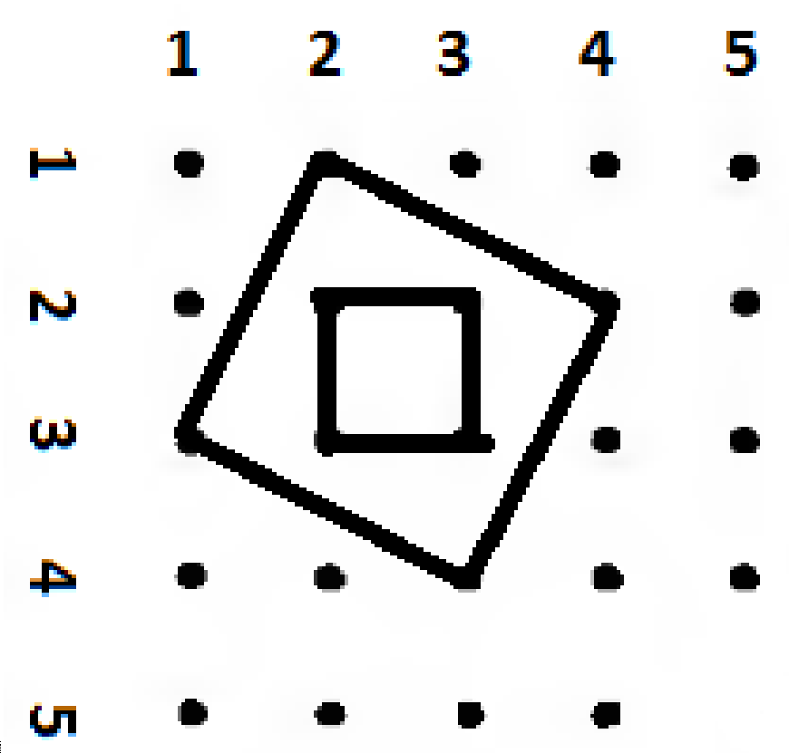

# Đề thi bảng C Hội thi Tin học trẻ thành phố Hà Nội lần thứ XXIII - 2017

## Hình vuông

Xét lưới điểm gồm *m* × *n* điểm, các hàng điểm được đánh số bắt đầu từ 1 đến
*m* từ trên xuống dưới, các cột điểm được đánh được đánh số bắt đầu từ 1 đến
*n* từ trái sang phải. Điểm nằm trên hàng điểm *i* và trên cột điểm *j* thì
điểm đó có tọa độ (*i*, *j*).

Tiến hành xóa đi một số điểm, hãy người ta muốn biết những điểm còn lại có thể
tạo được bao nhiêu hình vuông mà mỗi hình vuông có 4 đỉnh là 4 điểm trong các
điểm chưa bị xóa.

### Yêu cầu

Cho biết *m*, *n* và *k* điểm được xóa, hãy đếm số lượng hình vuông mà mỗi hình
vuông có 4 đỉnh là 4 điểm trong các điểm chưa bị xóa.

### Input
* Dòng đầu tiên chứa ba số nguyên *m*, *n*, *k*;
* Dòng thứ *i* trong *k* dòng tiếp theo chứa hai số nguyên *xi*,
  *yi* (1 ≤ *xi* ≤ *m*; 1 ≤ *yi* ≤ *n*) là
  thông tin về toạ độ của điểm thứ i.

### Output

Ghi số lượng hình vuông đếm được.

### Giới hạn

* Subtask 1 [25%]: *m*, *n* ≤ 10; *k* ≤ 10;
* Subtask 2 [25%]: *m*, *n* ≤ 100; *k* ≤ 100;
* Subtask 3 [25%]: *m*, *n* ≤ 1000; *k* = 0;
* Subtask 4 [25%]: *m*, *n* ≤ 1000; *k* ≤ 100.

### Ví dụ

| squares.inp  | squares.out |
| ------------ | :---------: |
| 5 5 1 5 5 |      46     |

